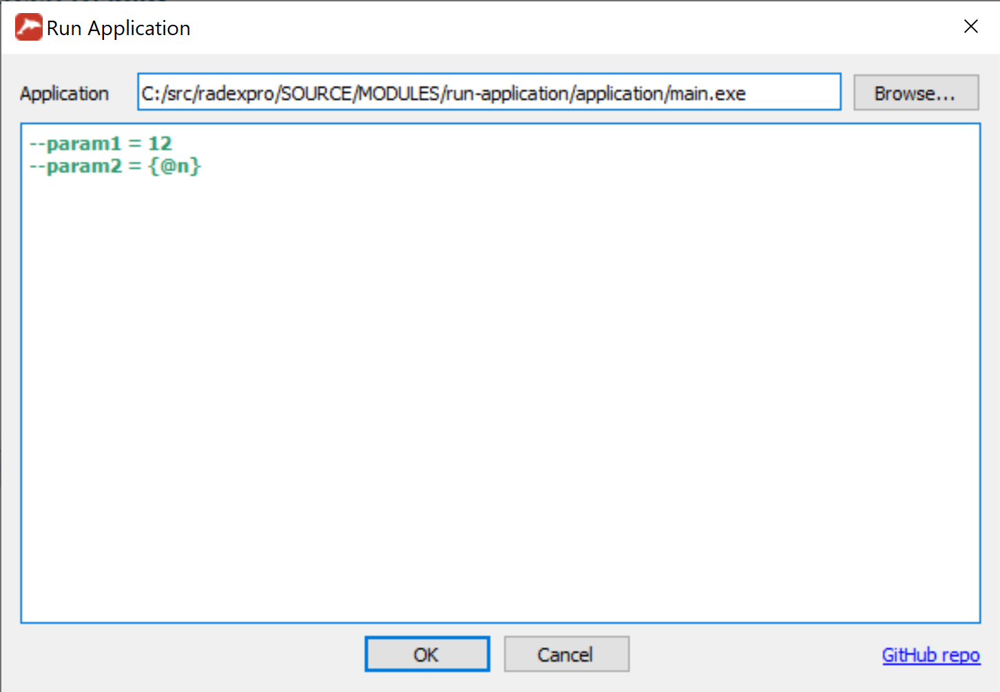

# Run Application

This is a [RadExPro](https://radexpro.com/ru/) module.
It allows you to execute any Windows application developed with radexproAPI.

## Application Description

The module is able to embed to RadExPro. It is able to run in flow 
with replicas. It is implemented as a DLL.
The picture below shows the module graphical user interface.

It allows you to choose the executabele with Open File Dialog by clicking
the  "Browse..." button. Also you can pass parameters to the executable
by typing key-value pairs according to the following: --key=value. Only
key-value pairs highlighted in green will be passed. 

## Dependencies

* [RadExPro](https://radexpro.com/ru/)
* [Qt 5.11.2](https://download.qt.io/new_archive/qt/5.11/5.11.2/)
* [MSVC 2017](https://visualstudio.microsoft.com/ru/vs/older-downloads/)

## DLL building and installing

### DLL building
1. Make a copy of **vcvars64.bat** at the directory:
`\path-to-msvc-folder\Microsoft Visual Studio\2017\Community\VC\Auxiliary\Build\`
**path-to-msvc-folder** is the path where MSVC2017 is installed

2. Name the copy as **vcvars64_radexpro.bat** and edit it by adding at the end
of the file the following:
`call "\path-to-qt-folder\5.11.2\msvc2017_64\bin\qtenv2.bat"`
**path-to-qt-folder** is the path where Qt 5.11.2 is installed.

3. Create Symbolic Link to **vcvars64_radexpro.bat** on the Desktop and name it
as **VS_2017_x64_radexpro**
Edit it by adding in the beggining of the **Target** field the following:
`%comspec% /k `

4. Execute **VS_2017_x64_radexpro** by clicking twice with mouse left button
and enter the following instructions one by one:
`cd \path-run-application-module-folder\`
`.\qmake`
**path-run-application-module-folder** is the path to the module repo.

5. Build the DLL:
	5.1. Run **RunApp.vcxproj** by clicking twice with mouse left button.
	5.2. Set up Solution Configuration equals to `Release`
	5.3. Set up Solution Platform equals to `x64`
	5.4. Press Ctrl+Shift+B
	
the rest...

### Installing

1. Check that RunApp.dll is at \path-to-RadExPro\
2. Run command prompt at `\path-to-RadExPro\`.
3. Execute the following instruction:
`regsvr32 .\RunApp.dll`
4. Done

## Executing the application

1. Put the module into RadExPro flow.
2. Choose the application to run.
3. Type the application parameters to the parameters field,
4. Run the RadExPro flow.
